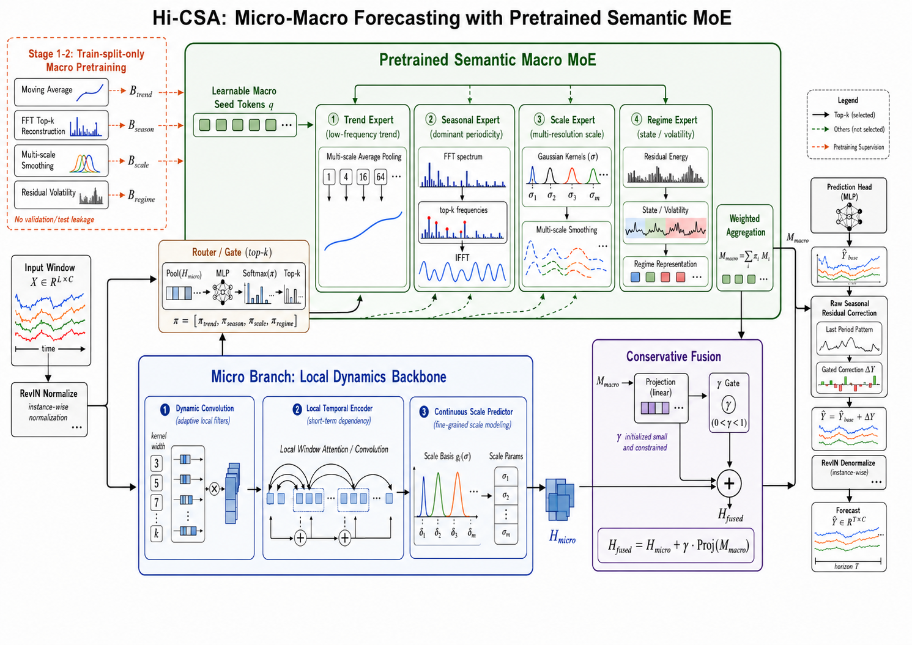

```bash
bash ./data/ETT/run_ETT.sh
```

Weather:

```bash
bash ./data/weather/run_weather.sh
```

Electricity:

```bash
bash ./data/electricity/run_electricity.sh
```

You can override the common forecast settings without editing the scripts:

```bash
PRED_LEN=336 BATCH_SIZE=16 bash ./data/weather/run_weather.sh
PRED_LEN=336 BATCH_SIZE=4 bash ./data/electricity/run_electricity.sh
```
